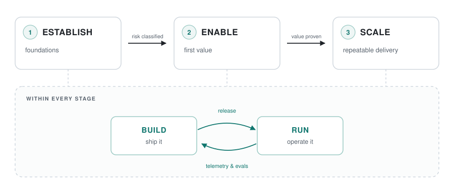

# GAIA Technology Systems

**A boutique AI consultancy.** We help organisations move from AI curiosity to AI capability - with an engineering-first approach, working governance, and systems that survive contact with production.

---

## What we do

We work with teams at every point of the curve: the ones running their first experiment, and the ones trying to make twenty scattered pilots add up to something.

| | |
|---|---|
| **AI assessments** | Where you actually stand - data, platform, governance, skills - and the shortest credible path to value. |
| **AI in existing platforms** | Adding assistants, retrieval, and agentic workflows to the products and internal systems you already run. |
| **PoV & MVP bootstrapping** | From hypothesis to a working, measurable proof in weeks - built to be extended, not thrown away. |
| **Architecture & enablement** | Reference architectures, evaluation harnesses, and the practices that let your own engineers take it forward. |

---

## The AI journey

Our work is organised around a journey map we use with every client - a shared picture of where you are and what comes next.

<picture>
  <source media="(prefers-color-scheme: dark)" srcset="assets/ai-journey-dark.svg">
  
</picture>

- **Establish** - data foundations, platform, and *governance & risk classification* before the first line of code.
- **Enable** - a first use case delivered end to end, with evaluation and guardrails built in.
- **Scale** - patterns, platform, and people that turn one success into a portfolio.

Running underneath all three: a continuous **build ⇄ run** loop, because an AI system is never finished - it is trained, shipped, watched, and corrected.

We also insist on naming **what kind of AI** a problem needs. Not everything is an agent; not everything needs a model at all. Choosing well is most of the work.

---

## How we build

**Cloud & platform** - Azure AI Foundry and the wider Azure ecosystem, from small deployments to enterprise landing zones.

**LLM systems** - orchestration, multi-agent architectures, and RAG with LangGraph, LlamaIndex, and LangChain.

**Classical ML** - supervised learning and exploratory analysis, for the many problems that do not need a foundation model.

**Languages** - Python, C#, and TypeScript by preference; whatever your stack requires in practice.

---

## Principles

1. **Governance is not paperwork.** Risk classification comes first, so what you build can be defended later.
2. **Evaluation before enthusiasm.** If we cannot measure it, we do not claim it.
3. **Build for handover.** Our best outcome is a client team that no longer needs us in the room.
4. **Small, senior, accountable.** Boutique by design - you work with the people doing the work.

---

## Get in touch

Starting something, stuck mid-pilot, or trying to make sense of what you already have - we are happy to talk.

📧 [contact@gaiatechnologysystems.com](mailto:contact@gaiatechnologysystems.com) · 🌐 [www.gaiatechnologysystems.com](https://www.gaiatechnologysystems.com) · 💼 [LinkedIn](https://www.linkedin.com/company/gaia-technology-systems/)

GAIA Technology Systems B.V. · Registered in the Netherlands
